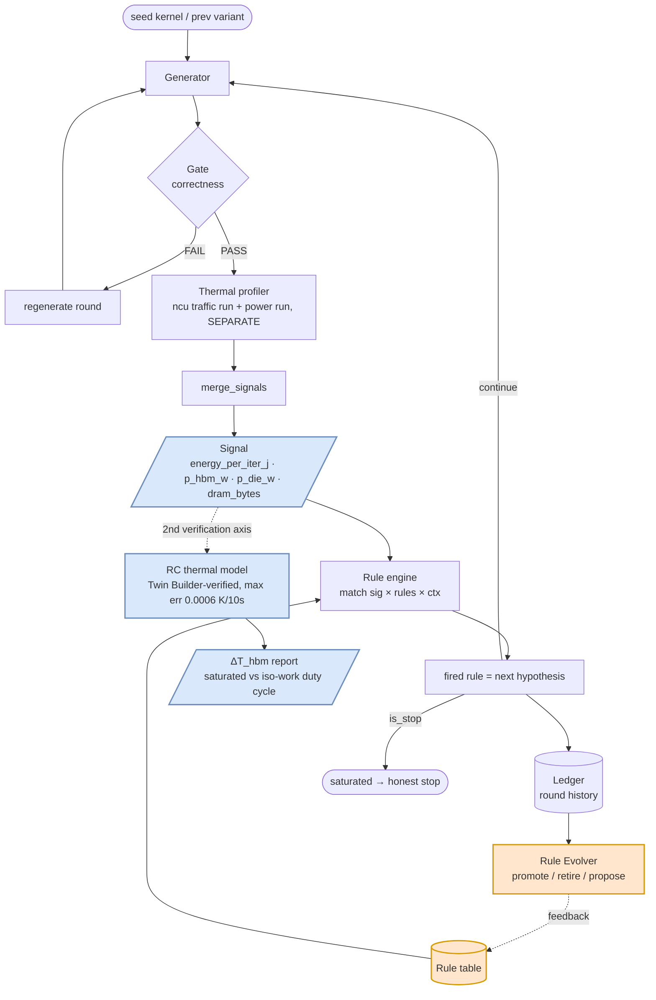

# Compiler_Thermal

A self-evolving optimization loop that judges GPU compiler transformations by **simulated
temperature (°C) and energy**, not latency. Fork of [GPU-Solver](https://github.com/alexxony/gpu-solver-loop)
(public) — same rule-evolution engine, objective function swapped from latency to
`energy_per_iter_j`. Prior-art survey (P0) found no thermal-judgment compiler work upstream of
this: the closest related work (energy-aware kernel generation, energy-aware agents) stops at
J/W — nobody carries the signal through to a physical ΔT via an RC thermal model.

> This README documents the thermal-axis project. For the sibling latency-axis project (the
> engine this was forked from) see [gpu-solver-loop](https://github.com/alexxony/gpu-solver-loop).

## Architecture



The rule engine (`rules.py`/`evolver.py`/`ledger.py`) is **unchanged** from GPU-Solver — only
the objective function changed (`harness._metric(mode="thermal")` compares
`-energy_per_iter_j` instead of `-latency`). Measurement runs the ncu traffic pass and the
power-sampling pass **separately** (they can't share a kernel launch) and reconciles them in
`merge_signals`. A second, independent verification axis converts the same measured power into
a hotspot ΔT (°C) via a two-node RC thermal model, cross-checked against Ansys Twin Builder.

## Key results (negative results included, not hidden)

| Phase | Result |
|---|---|
| **P3 — energy gain** | TF32 vs fp32 on matmul: **5.32×–5.75×** improvement in `energy_per_iter_j` (real A100). First measurement attempt read as "TF32 loses on energy" — traced to a definition bug (`energy_j` was a fixed 3.0s power-window integral, not divided by iteration count, so it collapsed to `-power` and structurally penalized the faster kernel). Fixed by switching to `energy_per_iter_j = power_avg_w × kernel_time_s`. |
| **P4 / P7 — RC ΔT verification axis** | Duty-cycle *definition* flips the conclusion: at 100% saturated duty, TF32 has *worse* ΔT (higher instantaneous power); at iso-work duty (15.66%), TF32 is **17.16 K better**. Direction agrees with the energy-axis result. Generalized to 4 problems — all agree in direction (PASS). |
| **P8 — KernelBench 35-problem scale ablation** | v4 verdict: matmul-class **7/8 = 87.5% PASS** (2.61×–6.00× gain), conv-fusion class falls short (rule/variant coverage gap, R0 STOP is legitimate — not a defect), memory-bound null rate **100% PASS**. v3 original-criterion figure (40% FAIL, undifferentiated) reported alongside, not suppressed. A reporter sign bug (`best=min(metric)` against a `-energy` convention) was caught by cross-checking raw metric curves against the statistical output, not by the reporter's own selfcheck. |
| **P10 — hotspot ΔT** | Extends the RC axis from average-power to a hotspot resistance path (`r_hbm_sink_max`, imported from the sibling HBM_build project's Ansys thermal model). All 4 non-null scenarios agree in direction (4/4 PASS) — but contrary to the pre-registered "attenuation" expectation, the hotspot gap **amplifies** relative to the average-power gap (ratio 1.23×–1.64×, e.g. matmul avg 17.16 K → hotspot 21.06–28.12 K). |
| **P11 — hotspot ΔT, second power condition** | Imports a second, independent hotspot resistance set from HBM_build (`r_hbm_sink_max_p4`: A/B cooling series × S0–S2 power maps, 6 cases, **30 W** FEM condition vs P10's 16 W). All 3 non-null problems agree in direction, 6/6 cases, under both an avg-axis and a P3-hotspot-axis check. The P10 amplification pattern (1.23×–1.64×) **reproduces under this second, independent power condition** (16 W → 30 W) — not attenuated. 27 new tests, independently verified 6/6 PASS. |
| **RC backend validation** | Own 2-node RC (forward Euler) vs Ansys Twin Builder: **max error 0.0006 K / 10s** step response. |

## Verification culture

- **GPU-free selfchecks** (`selfcheck.py`, `selfcheck_thermal.py`) validate the full plumbing
  (rule firing, retire/promote, energy pipeline) with a fake profiler — no GPU or Colab needed.
- **Independent verifier re-derivation**: every headline claim above was independently
  re-derived from raw ledger/result JSON (not re-stated from the implementer's report) before
  being written up.
- **sha256 reproducibility**: where a claim depends on a generated artifact (e.g. the P8
  stratified 35-problem sample), the artifact is regenerated from the CLI and hash-compared
  against the original — not just re-read.
- **Test suite**: currently **0 failed** (last independently re-run count: 250 passed / 15
  skipped). Skip count is non-deterministic — it varies run to run because one smoke test hits
  CUDA OOM under WSL memory limits and gets conditionally skipped, and a `triton`-not-installed
  environment gap is now also skip-classified rather than counted as failure — this is
  environmental, not a hidden regression; **new failures introduced by any phase's work: 0**,
  checked every phase.

## Repository layout

```
thermal/            # measurement + RC thermal model
  chip_caps.py       # per-chip power/HBM constants (A100 HBM2e 4.3 pJ/bit, T4/L4 GDDR6 7.0)
  power_sampler.py   # injectable power reader, trapezoidal energy integration
  measure.py         # merge_signals: reconciles the separate ncu + power runs
  duty_power.py      # power -> time series, duty-cycle average power
  twin_eval.py        # RC backend (2-node Euler), Twin Builder-verified
  hbm_split.py       # p_hbm / p_die power split

thermal_loop/        # the evolution loop, forked from GPU-Solver's loop/
  rules.py, evolver.py, ledger.py   # UNCHANGED from GPU-Solver (same mechanism)
  harness.py         # objective function: energy_per_iter_j instead of latency
  executor.py        # kernel run + thermal profiling (traffic run + power run, separate)
  colab_profiler.py, run_ablation_remote.py   # colab-cli remote batch ablation
  kb_convert.py, kb_stratify.py, audit_kb_convert.py   # KernelBench problem-definition ingest
  report_p4_deltat.py, report_p8_stats.py, report_p9a_signals.py   # phase-specific reporters
  selfcheck.py, selfcheck_thermal.py   # GPU-free pipeline checks

problems/            # seed kernels — legacy (matmul, batched_gemm, kb_matmul_scalar,
                     #   kb_softmax) + KernelBench-derived (35-problem stratified sample)
tests/               # 20 files
```

`artifacts/` and `results/` (raw logs, ledgers, per-run JSON) are gitignored — kept locally,
not committed, per this project's convention; claims trace back to them but the files
themselves aren't versioned.

## Running it

```bash
# install
uv sync --extra local

# GPU-free pipeline check — no torch/ncu required
python3 thermal_loop/selfcheck_thermal.py

# full local test suite
uv run pytest

# real measurement (needs google-colab-cli authenticated, A100/T4 session)
python3 thermal_loop/run_ablation_remote.py <problem_list> <max_rounds> --session=<s> --gpu=A100
```

Colab measurement is optional for verifying the plumbing — the fake-profiler selfchecks above
exercise the same rule-firing / retire / promote logic without a GPU.

## KernelBench attribution

Problem *definitions* for the scale-ablation phase (P8) are ingested from
[ScalingIntelligence/KernelBench](https://github.com/ScalingIntelligence/KernelBench) via
`thermal_loop/kb_convert.py` — the benchmark repository is not modified or vendored; only its
problem specs are converted into this project's `solve.py` format. The rule/evolution engine
itself never touches KernelBench code.

## License

MIT — see [LICENSE](LICENSE). Personal portfolio / research prototype.
