# Compiler-Thermal


> This README documents the thermal-axis project. For the sibling latency-axis engine it
> forks from, see [gpu-solver-loop](https://github.com/alexxony/gpu-solver-loop).

## 1. What this is

A simulation-based optimization loop that judges GPU compiler transformations by **RC-model
thermal delta (ΔT, K) and energy**, not latency. On real A100 measurements feeding a validated
thermal model: TF32 vs fp32 on matmul improves `energy_per_iter_j` by **5.32×–5.75×**, that
energy gain translates to **17.16 K** better hotspot ΔT at iso-work duty cycle, and a
KernelBench-derived 35-problem ablation reproduces the gain on **7/8 (87.5%) of the
compute-bound matmul bucket** while memory-bound problems correctly show a null (100% PASS)
rather than a false gain.

## 2. Why this is needed

A dedicated prior-art survey (6 systems: Zhang et al. 2024 energy-aware kernel generation,
KernelPro, FlipFlop, Zeus, GPOEO, and LPTN/Twin Builder thermal-ROM work) found no system that
carries a compiler-transformation decision through to a simulated physical temperature. The
closest work stops at energy (J) or power (W) as the judged quantity. Thermal-aware scheduling,
DVFS, and floorplanning are themselves not new — they've existed since the 2000s — but none of
the surveyed systems couples that kind of judgment to an RC thermal model driven by measurement
feedback. **The contribution here is narrow: take the LLM-agent optimization loop's
objective-function slot — normally latency or energy — and put a simulated RC-model ΔT in it
instead**, with the same measurement-driven rule evolution as the sibling latency-axis project.

| System | Judged quantity | Rule/decision feedback loop |
|---|---|---|
| Zhang et al. 2024 (energy-aware kernel gen) | Energy (J) | No — static cost model, no measurement-driven rule update |
| KernelPro | Latency (primary), energy (tiebreak) | No — bottleneck classification is LLM-judged, not rule-evolved |
| FlipFlop | Power/energy (static estimate) | No — static analysis, no runtime feedback |
| Zeus | Energy (J), via NVML | No — hyperparameter/power-cap tuning, not a rule table |
| GPOEO | Energy, DVFS setpoint | No — online frequency search, not a classification rule table |
| LPTN / Twin Builder thermal-ROM | Temperature (°C) | N/A — thermal simulation only, never coupled to a compiler loop |
| **This project** | **Simulated hotspot ΔT (K), via RC model** | **Yes — same rule/evolver/ledger mechanism as gpu-solver-loop** |

This project is one of three sibling projects sharing the same optimization-loop discipline
applied to different objective functions: it is a controlled transfer experiment forked from
[gpu-solver-loop](https://github.com/alexxony/gpu-solver-loop) with the objective swapped from
latency to RC-model ΔT, while [hbm-build](https://github.com/alexxony/hbm-build) supplies the
Ansys Icepak hotspot thermal-resistance values (`rc_params.csv`) that anchor this project's RC
model. All three independently follow the same disciplined pattern — controlled ON/OFF
comparison, immediate ledger recording, and honest negative-result reporting (see `JOURNAL.md`
here) — without claiming the three repos are procedurally identical; where they diverge (e.g.
pre-registered hypotheses, independent re-derivation) is stated plainly in section 5.

## 3. How it works



This is a **controlled transfer experiment, not a rewrite**: `rules.py`, `evolver.py`, and
`ledger.py` are unchanged from gpu-solver-loop — only the objective function changed
(`harness._metric(mode="thermal")` compares `-energy_per_iter_j` instead of `-latency`).
Measurement runs the ncu traffic pass and the power-sampling pass **separately** (they can't
share a kernel launch) and reconciles them in `merge_signals`. A second, independent verification
axis converts the same measured power into a hotspot ΔT (K) via a two-node RC thermal model,
cross-checked against Ansys Twin Builder.

### Repository layout

```
thermal/            # measurement + RC thermal model
  chip_caps.py       # per-chip power/HBM constants (A100 HBM2e 4.3 pJ/bit, T4/L4 GDDR6 7.0)
  power_sampler.py   # injectable power reader, trapezoidal energy integration
  measure.py         # merge_signals: reconciles the separate ncu + power runs
  duty_power.py      # power -> time series, duty-cycle average power
  twin_eval.py       # RC backend (2-node Euler), Twin Builder-verified
  hbm_split.py       # p_hbm / p_die power split

thermal_loop/        # the evolution loop, forked from gpu-solver-loop's loop/
  rules.py, evolver.py, ledger.py   # UNCHANGED from gpu-solver-loop (same mechanism)
  harness.py         # objective function: energy_per_iter_j instead of latency
  executor.py        # kernel run + thermal profiling (traffic run + power run, separate)
  colab_profiler.py, run_ablation_remote.py   # colab-cli remote batch ablation
  kb_convert.py, kb_stratify.py, audit_kb_convert.py   # KernelBench problem-definition ingest
  report_p4_deltat.py, report_p8_stats.py, report_p9a_signals.py   # phase-specific reporters
  selfcheck.py, selfcheck_thermal.py   # GPU-free pipeline checks

problems/            # seed kernels — legacy (matmul, batched_gemm, kb_matmul_scalar,
                     #   kb_softmax) + KernelBench-derived (35-problem stratified sample)
tests/               # 20 files
evidence/            # curated ledger subset backing the headline numbers below
```

### Run

```bash
# install
uv sync --extra local

# GPU-free pipeline check — no torch/ncu required
python3 thermal_loop/selfcheck_thermal.py

# full local test suite
uv run pytest

# real measurement (needs google-colab-cli authenticated, A100/T4 session)
python3 thermal_loop/run_ablation_remote.py <problem_list> <max_rounds> --session=<s> --gpu=A100
```

Colab measurement is optional for verifying the plumbing — the fake-profiler selfchecks above
exercise the same rule-firing / retire / promote logic without a GPU.

### KernelBench attribution

Problem *definitions* for the scale-ablation phase (P8) are ingested from
[ScalingIntelligence/KernelBench](https://github.com/ScalingIntelligence/KernelBench) via
`thermal_loop/kb_convert.py` — the benchmark repository is not modified or vendored; only its
problem specs are converted into this project's `solve.py` format. The rule/evolution engine
itself never touches KernelBench code.

Methodology details: [docs/METHOD.md](docs/METHOD.md)

## 4. Evidence — where to look

`artifacts/` and `results/` (raw logs, ledgers, per-run JSON) are gitignored and stay local, per
this project's convention. A curated subset backing every headline number below is committed to
[`evidence/`](evidence/), with a file-by-file map from claim to source in
[`evidence/README.md`](evidence/README.md).

| Claim | Evidence file(s) | Field / derivation |
|---|---|---|
| TF32 vs fp32 energy gain, **5.32×–5.75×** | `evidence/thermal-gain-matmul-{on,off}.jsonl` | round0→round1 ratio of `signal.energy_per_iter_j`, re-derivable with a 6-line script in `evidence/README.md` |
| Hotspot ΔT anchor, **17.16 K** (iso-work duty) | `evidence/p6_kbms_retry_20260713_result.json`, `evidence/p7_bgemm_softmax_20260714_result.json` | **derived value** — not stored directly in the ledger; computed from these files' raw `p_die_w`/`p_hbm_w` signals by `thermal_loop/report_p4_deltat.py` via the `RC_KW_LEGACY` RC-model constants, regression-gated in `tests/test_hotspot_deltat.py` |
| KernelBench 35-problem ablation, v3 **40% FAIL** / v4 **87.5% PASS**, 2.61×–6.00× | `evidence/p8_stats_final_v3_20260719.txt` | per-problem M1 gain ratio and `null` columns; v4 is a bucket reclassification of the same underlying v3 results, not a re-measurement |
| Hotspot amplification **1.23×–1.64×**, P11 30 W condition, 6/6 direction match | `evidence/p11_verify_status.md` | independent verifier's disk-forensic re-derivation, not a self-report; underlying `rc_params.csv` values (hbm-build project) spot-checked to 6 decimal places in §4 |
| RC backend validation, **max error 0.0006 K / 10 s** | `evidence/twinbuilder_tr1_ref.csv` | Ansys Twin Builder TR1 step-response reference, compared against this project's `RcBackend` in `tests/test_twin_eval.py` |

### Reproduce

```bash
# GPU-free plumbing check
python3 thermal_loop/selfcheck_thermal.py

# RC backend vs Twin Builder reference
.venv/bin/python -m pytest tests/test_twin_eval.py -v

# full local suite
uv run pytest
```

## 5. Limits / not proven

- **No physical measurement — simulation vs. simulation.** Every ΔT and energy figure here comes
  from measured GPU power/traffic signals fed through a compact RC thermal model, cross-checked
  against Ansys Twin Builder simulation output. There is no physical thermocouple or die-shot
  ground truth anywhere in this chain.
- **The iso-work duty cycle (15.66%) is a chosen comparison basis, not the only valid one, and
  it is load-bearing.** It compares "heat produced to finish the same amount of work" — at
  100% saturated duty the conclusion **flips**: TF32 shows *worse* ΔT at full instantaneous
  saturation, and only comes out ahead once you account for it finishing the work faster and
  idling sooner. Both duty-cycle regimes are reported; iso-work is the one used for the 17.16 K
  headline because it isolates the quantity actually being compared (heat per unit of work done).
- **KernelBench ablation is 40% at the pre-registered criterion.** The v4 87.5%/7-of-8 figure is
  a reclassification (compute-matmul bucket only, conv-fusion separated out) of the same v3
  results — not a re-measurement. The v3 40% figure, measured against the original pre-registered
  criterion, is reported alongside rather than replaced.
- **Hotspot amplification (1.23×–1.64×) contradicts the pre-registered expectation.** Attenuation
  was hypothesized going in; amplification is what measurement showed, at both the P10 (16 W)
  and P11 (30 W, independent second power condition) levels. Reported as observed, not adjusted
  to fit the hypothesis.
- **No claim of identical methodology across all three sibling repos.** This repo and hbm-build
  both document pre-registered hypotheses with recorded reversals (P10 here, P4 there) and
  sha256-checked reproducibility of generated artifacts; gpu-solver-loop does not have documented
  evidence of either practice. All three do independently follow a narrower five-rule pattern —
  controlled ON/OFF comparison, immediate structured ledger recording, and honest reporting of
  negative/reversed results — and that narrower pattern is what's asserted to hold across all
  three, not full procedural identity.
- **Independent verification here means re-derivation from raw ledger files by a separate
  reviewing pass within this project**, not an external, disinterested third party. `evidence/`
  exists specifically so an outside reader can perform that re-derivation themselves.

## 6. Status

Test suite: currently **0 failed** (last re-run: 250 passed / 15 skipped). Skip count is
non-deterministic — one smoke test hits CUDA OOM under WSL memory limits and is conditionally
skipped, and a `triton`-not-installed environment gap is skip-classified rather than counted as
failure. What's invariant across every phase's work: **new failures introduced: 0**, checked
every phase.

Hotspot ΔT has been verified under two independent power conditions (16 W and 30 W) with the
same amplification pattern reproducing both times. Remaining open items: scaling the KernelBench
ablation beyond the 35-problem stratified sample, and closing the conv-fusion rule/variant
coverage gap identified in the ablation.

## License

MIT — see [LICENSE](LICENSE). Personal portfolio / research prototype.
